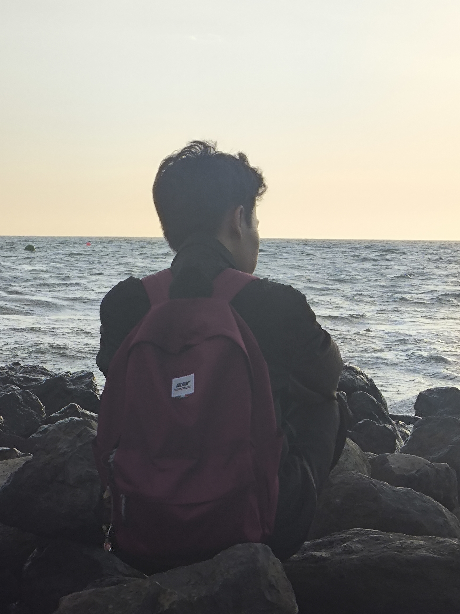

<!DOCTYPE html>
<html lang="id">
  <head>
    <meta charset="UTF-8" />
    <meta name="viewport" content="width=device-width, initial-scale=1.0" />
    <title>Website Pribadi - Nanda Aditya</title>
    <link
      href="https://fonts.googleapis.com/css2?family=Roboto:wght@300;400;700&display=swap"
      rel="stylesheet"
    />
    
  </head>
  <body>
    <nav>
      <ul>
        <li><a href="#hero">Home</a></li>
        <li><a href="#about">About</a></li>
        <li><a href="#skills">Skills</a></li>
        <li><a href="#portfolio">Portfolio</a></li>
        <li><a href="#contact">Contact</a></li>
      </ul>
    </nav>

    <section id="hero">
      <h1>Nanda Aditya</h1>
      
Web Developer & Designer

    </section>

    <section id="about">
      
      <h2>About Me</h2>
      

        Halo! Saya Nanda Aditya Pratama, Saya asal Makassar, Sulawesi Selatan,
        Indonesia. Hobi saya menonton, membaca, bermain game dan traveling.
      

      

        Deskripsi lebih lanjut: Saya kuliah di Universitas Negeri Makassar,
        Jurusan Pendidikan Teknik Elektronika, Prodi D4 Teknik Elektronika,
        Kegiatan saya sebagai mahasiwa itu belajar dan mencari hal hal baru di
        kampus yang saya tidak dapatkan di dunia sebelumnya.
      

    </section>

    <section id="skills">
      <h2>Skills</h2>
      

        

          <h3>HTML & CSS</h3>
          
Expert in building responsive websites.

        

        

          <h3>JavaScript</h3>
          
Proficient in ES6, React, and Node.js.

        

        

          <h3>Python</h3>
          
Experienced in backend development with Flask/Django.

        

      

    </section>

    <section id="portfolio">
      <h2>Portfolio</h2>
      

        

          
          <h3>Photo 1: Graduation</h3>
          
photo together with friends from vocational school.

        

        

          
          <h3>Photo 2: Graduation</h3>
          
photo together with friends from vocational school.

        

        

          
          <h3>Photo 3: graduation medal presentation</h3>
          
receive a graduation medal

        

      

    </section>

    <section id="contact">
      <h2>Contact</h2>
      <ul style="list-style: none; padding: 0">
        <li>
          Email:
          <a href="nandaadityapratama0711@gmail.com"
            >nandaadityapratama0711@gmail.com</a
          >
        </li>
        <li>
          LinkedIn:
          <a href="https://lynk.id/mountskuy" target="_blank"
            >https://lynk.id/mountskuy</a
          >
        </li>
        <li>
          Instagram:
          <a
            href="https://www.instagram.com/mountskuy?igsh=NGV3bWEybGVqMWdy"
            target="_blank"
            >https://www.instagram.com/mountskuy?igsh=NGV3bWEybGVqMWdy</a
          >
        </li>
      </ul>
    </section>

    <footer>
      
&copy; 2023 John Doe. All rights reserved.

    </footer>

    
  </body>
</html>

